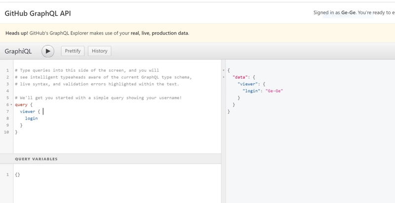

# Graphql实践——像axios一样使用Graphql


#### Graphql尝鲜

在只学习graphql client端知识的过程中，我们常常需要一个graphql ide来提示graphql语法，以及实现graphql的server端来进行练手。 graphql社区提供了[graphiql](https://github.com/graphql/graphiql)让我们使用

> graphiql \(npm\)：一个交互式的运行于浏览器中的 GraphQL IDE.

但graphiql提供的[live demo](http://graphql.org/swapi-graphql)基本打不开，难道刚接触graphql就要自己实现graphql的server端？ 好在github用graphql写了一套api，我们可以去[这里](https://developer.github.com/v4/explorer/)，登陆后即可体验一把graphql。



关于graphql的基础知识可以去这里[看看](http://graphql.cn/learn/)

#### graphql client端选择

graphql在前端实现有以下方案。

> Relay \(github\) \(npm\)：Facebook 的框架，用于构建与 GraphQL 后端交流的 React 应用。  
> Apollo Client \(github\)：一个强大的 JavaScript GraphQL 客户端，设计用于与 React、React Native、Angular 2 或者原生 JavaScript 一同工作。  
> graphql-request：一个简单的弹性的 JavaScript GraphQL 客户端，可以运行于所有的 JavaScript 环境（浏览器，Node.js 和 React Native）—— 基本上是 fetch 的轻度封装。  
> Lokka：一个简单的 JavaScript GraphQL 客户端，可以运行于所有的 JavaScript 环境 —— 浏览器，Node.js 和 React Native。  
> nanogql：一个使用模板字符串的小型 GraphQL 客户端库。

从npm download数量上看Apollo Client是最多的，并且Apollo也有[服务端](https://www.apollographql.com/server) 的解决方案，所以这里选择Apollo Client作为graphql的client端 apollo client对于web 框架都有具体的实现，但是我更希望能像axios那样去使用graphql，而不是每套web框架都要去学一下具体实现，那样会折腾死自己。


#### 初始化项目

```text
// 使用vue-cli初始化项目
vue init webpack-simple my-project
npm i
```

**安装graphql**

```text
npm i apollo-cache-inmemory apollo-client apollo-link apollo-link-http 
npm i graphql graphql-tag
```

**项目结构如下**

```text
.
├── index.html
├── package.json
├── package-lock.json
├── README.md
├── src
│   ├── App.vue
│   ├── graphql                            // 接口
│   │   ├── search.graphql
│   │   └── index.js                       // export所有接口
│   ├── main.js
│   └── utils
│       └── graphql.js                    // 对Apollo-client封装
└── webpack.config.js
```

#### apollo-client

接下来对apollo-client进行封装，加上中间件（实现类似于axios拦截器的效果）。 graphql.js

```text
import ApolloClient from 'apollo-client'
import { InMemoryCache } from 'apollo-cache-inmemory'
import { HttpLink } from 'apollo-link-http'
import { onError } from 'apollo-link-error'
import { ApolloLink, from } from 'apollo-link'

const token = '598ffa46592d1c7f57ccf8173e47290c6db0d549'

const Middleware = new ApolloLink((operation, forward) => {
  // request时对请求进行处理
  console.log('Middleware', operation, forward)
})
const Afterware = new ApolloLink((operation, forward) => {
  return forward(operation).map(response => {
    // 服务器返回数据
    console.log('Afterware--response', response)
    return response
  })
})
const errorLink = onError(({ graphQLErrors, networkError }) => {
  if (graphQLErrors)
    graphQLErrors.map(({ message, locations, path }) =>
      console.log(
        `[GraphQL error]: Message: ${message}, Location: ${locations}, Path: ${path}`,
      ),
    );
  if (networkError) console.log(`[Network error]: ${networkError}`);
});

const httpLink = new HttpLink({
  uri: 'https://api.github.com/graphql', // 配置请求url 
  headers: {                             // 配置header
    Authorization: `Bearer ${token}`
  }
})
const cache = new InMemoryCache()       // 缓存
export default new ApolloClient({
  link: from([Middleware, Afterware, errorLink, httpLink]),
  cache
})
```

配置webpack支持.graphql文件

```text
     // 在rules下添加以下规则
      {
        test: /\.(graphql|gql)$/,
        exclude: /node_modules/,
        loader: 'graphql-tag/loader',
      }
```

search.graphql

```text
query searchR ($keyword: String!) {
    search (query: $keyword , type: REPOSITORY){
        userCount
    }
}
```

在/graphql/index.js export所有接口

```text
import client from '../utils/graphql'
// import gql from 'graphql-tag'
import * as searchGql from './search.graphql'
/** searchGql模块 **/
export const search = (params) => client.query({query: searchGql.search, variables: params})
```

到这里我们已经可以直接调用/graphql/下导出的function

#### 使用github接口实现一个简单的搜索功能

具体实现就不贴出来了，全部代码已经放到[github](https://github.com/Ge-Ge/graphql_demo)，欢迎star。

run的时候有记得把token换成自己的，因为我的token有可能已经失效。


