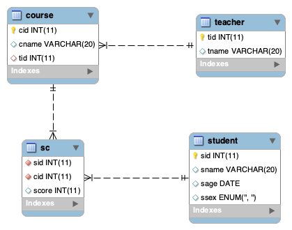

### 练习题.sql文件[下载](example.sql)
### 数据库ER图


查询学生课程成绩
```sql
select * from student, sc where student.sid = sc.sid;
```
查询"1"课程比"2"课程成绩高的学生的信息及课程分数
```sql
/*方法一*/
select a.* from (select * from sc a where a.cid='1') a, (select * from sc b where b.cid='2') b
where a.sid=b.sid and a.score > b.score;
/*方法二*/
select * from sc a
where a.cid='1'
and  exists(select * from sc b where b.cid='2' and a.score>b.score
and a.sid = b.sid);
/*方法三*/
select  student.sid, student.sname, student.ssex, sc1.sid, sc1.cid as '科目一', sc1.score,  sc2.cid as '科目二', sc2.score  from student, sc sc1, sc sc2 where sc1.score > sc2.score and sc1.cid = 1 and sc2.cid = 2 and student.sid = sc1.sid and sc1.sid = sc2.sid;
```
查询平均成绩大于等于60分的同学的学生编号和学生姓名和平均成绩
```sql
select s.sid,s.sname,avg(sc.score) from student s,sc group by s.sid having avg(sc.score)>=60;
```
查询课程名称为"数学"，且分数低于60的学生姓名和分数
```sql
select * from sc,student where sc.cid = '1'  and sc.score < 60 and student.sid = sc.sid;
```
查询学过"张三"老师授课的同学的信息
```sql
select st.* from student st 
join sc s on st.sid=s.sid
join course c on s.cid=c.cid
join teacher t on c.tid=t.tid
where t.tname='张三';
```
查询各科成绩最高和最低的分：以如下形式显示：课程ID，最高分，最低分
```sql
select sc.cid, max(sc.score), min(sc.score) from sc  group by sc.cid;
```
查询男生、女生人数
```sql
select student.ssex, count(*) from student group by student.ssex;
```
查询每门课程被选修的学生数
```sql
select sc.cid, count(*) from sc group by sc.cid;
```
统计每门课程的学生选修人数（超过2人的课程才统计）。要求输出课程号和选修人数，查询结果按人数降序排列，若人数相同，按课程号升序排列 
```sql
select cid,count(sid) from sc group by cid having count(sid)>2 order by count(sid) desc,cid ASC;

```
查询每门课程被选修的学生数
```sql
select sc.cid, count(*) from sc group by sc.cid;
```
统计每门课程的学生选修人数（超过2人的课程才统计）。要求输出课程号和选修人数，查询结果按人数降序排列，若人数相同，按课程号升序排列 
```sql
select cid,count(sid) from sc group by cid having count(sid)>2 order by count(sid) desc,cid ASC;

```